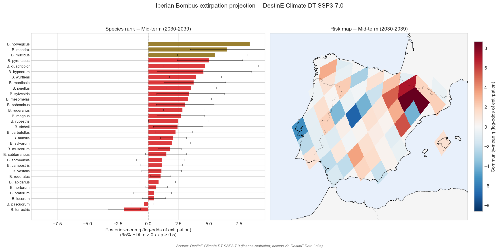

# weatherxbiodiversity-projection

> **Iberian *Bombus* extirpation under DestinE Climate DT SSP3-7.0 — replication of Soroye et al. (2020).**
> Reference paper: [10.1126/science.aax8591](https://doi.org/10.1126/science.aax8591)

This repository is a self-contained replication of the headline claim of Soroye et al. (2020), *"Climate change contributes to widespread declines among bumble bees across continents"*, applied to **Iberian *Bombus*** with a future projection under DestinE Climate DT SSP3-7.0.

The replication has **two tiers**:

- **Tier 1 — historical fit.** Replicates Soroye's GLMM on Iberian *Bombus* using Soroye's own CRU TS 3.24.01 climate inputs (Figshare deposit) and own-issued GBIF download DOIs. Run twice: once on the original CEA grid (~100 km), once on HEALPix nside=64 (~92 km).
- **Tier 2 — future projection.** Applies the fitted GLMM to DestinE Climate DT SSP3-7.0 (IFS-NEMO standard, native HEALPix nside=128) for the 2020–2029 and 2030–2039 horizons. The only place new climate data enters.

## Headline result — Tier 1

![Tier-1 GLMM coefficient summary: sc_TEI_delta is positive, large, and credible at CEA (+0.479) and HEALPix nside=64 (+0.454, 95% HDI [+0.130, +0.751])](figures/main_result_healpix.png)

**Soroye's central biological claim — that thermal-niche exceedance increases extirpation probability — replicates on Iberian *Bombus* at both spatial substrates.** The GLMM coefficient on `sc_TEI_delta` is positive, large, and credible:

| Substrate | sc_TEI_delta β | Status |
|---|---:|---|
| CEA (~100 km) | **+0.479** | Replicated (Tier 1) |
| HEALPix nside=64 (~92 km) | **+0.454**, HDI [+0.130, +0.751] | Substrate-robust (Tier 1) |

A higher-resolution sibling study at HEALPix nside=128 ([`weatherxbiodiversity-projection-nside128`](https://github.com/annefou/weatherxbiodiversity-projection-nside128)) finds **+0.347, HDI [+0.139, +0.533]** — within ±30% of CEA, so the Tier-1 finding holds across three independent pixelisations.

## Headline result — Tier 2



Under SSP3-7.0 at 2030–2039, mean future TEI rises from ~0.43 (historical) to ~0.45–0.50, a systematic shift toward each species' upper thermal niche edge. **None of the studied Iberian *Bombus* species hits TEI > 1 (Soroye's actual extirpation threshold) at any currently-occupied cell over the next 15 years** — the "extirpation event" is a longer-timescale phenomenon, with 2030–2039 being the early-warning period.

The substrate-stable high-risk and low-risk rankings (filtered to species with ≥10 occupied cells per substrate, using main-effects-only η — see methodology in [`weatherxbiodiversity-substrate-sensitivity`](https://github.com/annefou/weatherxbiodiversity-substrate-sensitivity)):

| Rank | Highest risk | n@64 |
|---|---|---:|
| 1 | *B. humilis* | 23 |
| 2 | *B. muscorum* | 25 |
| 3 | *B. ruderarius* | 16 |

| Rank | Safest | n@64 |
|---|---|---:|
| 1 | *B. terrestris* | 57 |
| 2 | *B. pascuorum* | 46 |
| 3 | *B. pratorum* | 25 |

Biologically coherent: *B. terrestris* is the dominant Western Palearctic generalist; *B. humilis*, *muscorum*, *ruderarius* are short-tongued grassland specialists already in decline elsewhere in Europe.

## Caveat — small-N species cannot be ranked reliably

Per-species ranking under SSP3-7.0 is grid-coupled at the projection step for species with fewer than ~10 historical Iberian cells. This affects 18 of 31 species, including the narrowly-distributed Pyrenean specialists (*B. pyrenaeus*, *B. mucidus*, *B. mendax*, *B. wurflenii*) — precisely the species the public most worries about. The substrate-sensitivity diagnostic is documented in the sibling repo [`weatherxbiodiversity-substrate-sensitivity`](https://github.com/annefou/weatherxbiodiversity-substrate-sensitivity).

## Quick start

```bash
git clone https://github.com/annefou/weatherxbiodiversity-projection.git
cd weatherxbiodiversity-projection
mamba env create -f environment.yml
mamba activate weatherxbiodiversity-projection
snakemake --cores 1            # Tier 1 (CEA + HEALPix) — runs anywhere
snakemake --cores 1 tier2      # Tier 2 (DestinE) — needs DestinE credentials
```

Tier 1 runs end-to-end on a generic machine (Mac, Linux, GitHub Actions). Tier 2 requires DestinE Climate DT credentials (LUMI polytope endpoint) and only runs on the DestinE Jupyter platform or a runner with valid credentials.

Or with Docker (Tier 1 only):

```bash
docker run --rm ghcr.io/annefou/weatherxbiodiversity-projection:latest
```

## Pipeline structure

The pipeline notebooks are organised in the left-hand TOC into three tiers:

- **Tier 1 — CEA replication of Soroye et al. 2020** (notebooks 01–04)
- **Tier 1 — HEALPix nside=64 extension** (notebooks 02h–04h)
- **Tier 2 — DestinE Climate DT SSP3-7.0 projection** (notebooks 05–08)

## Citation

If you use this work, please cite:

- This software: [`CITATION.cff`](https://github.com/annefou/weatherxbiodiversity-projection/blob/main/CITATION.cff) → DOI [10.5281/zenodo.20113777](https://doi.org/10.5281/zenodo.20113777).
- The original paper: [10.1126/science.aax8591](https://doi.org/10.1126/science.aax8591).
- The sibling substrate-extension and substrate-sensitivity repos via their own DOIs (see CITATION.cff `references`).
